# Second Project

## Table of Contents

### [1. OWASP Juice Shop Vulnerabilities](#1-owasp-juice-shop-vulnerabilities-1)
- [SQL Injection](#1-sql-injection)
- [Cross Site Scripting (XSS)](#2-cross-site-scripting-xss)
- [Administration Panel](#3-administration-panel)
- [Post a product review as another user](#4-post-a-product-review-as-another-user)
- [View Another User's Shopping Basket](#5-view-another-users-shopping-basket)

### [2. Root Me](#2-root-me-1)


---

## 1) OWASP Juice Shop Vulnerabilities

### 1. SQL Injection

SQL injection vulnerabilities exist on the login page, allowing unauthorized access to accounts by bypassing authentication. For example, using the following payload in the email or password field:

```sql
' OR '1'='1' --
```

This payload exploits improper handling of user input in SQL queries, forcing the system to evaluate the condition as always true, thus granting access without verifying credentials.

#### Steps to Reproduce:
1. Go to the login page.
2. Enter the payload in either the email or password field and submit it.
3. You will be logged in as an administrator or another valid user.

#### Potential Impact:
- Unauthorized access to sensitive user accounts.
- Data leakage and potential compromise of administrative privileges.

#### Mitigation:
- Use prepared statements or parameterized queries to handle user input securely.
- Validate and sanitize input to ensure it does not alter the intended SQL logic.
- Implement proper error handling to avoid revealing system information.

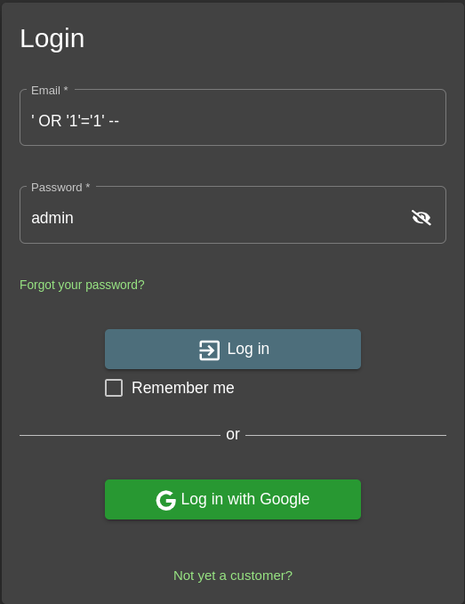

After exploiting this vulnerability, we successfully gain access to the admin account.

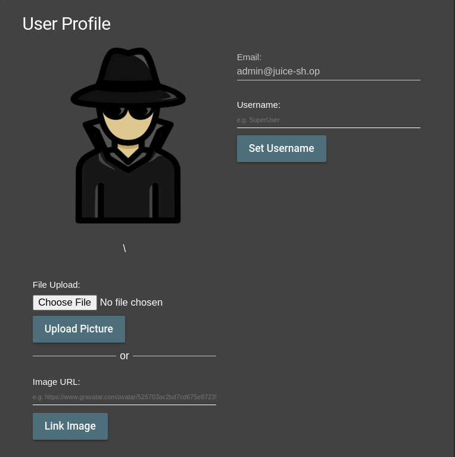

---

### 2. Cross Site Scripting (XSS)

Cross-Site Scripting (XSS) vulnerabilities are also present on the site. This allows malicious scripts to be executed in the context of a user's browser. For instance, injecting the following payload into a search bar or comment field may trigger an alert box:

```html
<script>alert('XSS');</script>
```

#### Steps to Reproduce:
1. Navigate to a page that accepts user input, such as a search bar or comments section.
2. Enter the payload shown above and submit it.
3. Observe the alert box popping up, which demonstrates the XSS vulnerability.

#### Potential Impact:
- Malicious actors could use this to steal session cookies, redirect users to phishing sites, or perform other malicious actions in the context of a user session.

#### Mitigation:
- Sanitize user input to remove or encode special characters.
- Implement Content Security Policy (CSP) to restrict the execution of unauthorized scripts.
- Use secure frameworks and libraries that mitigate XSS risks.

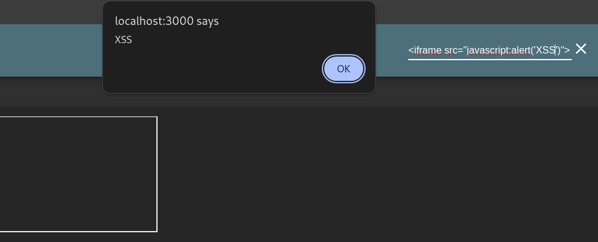

And with this we can access cookies with which the account can be hacked

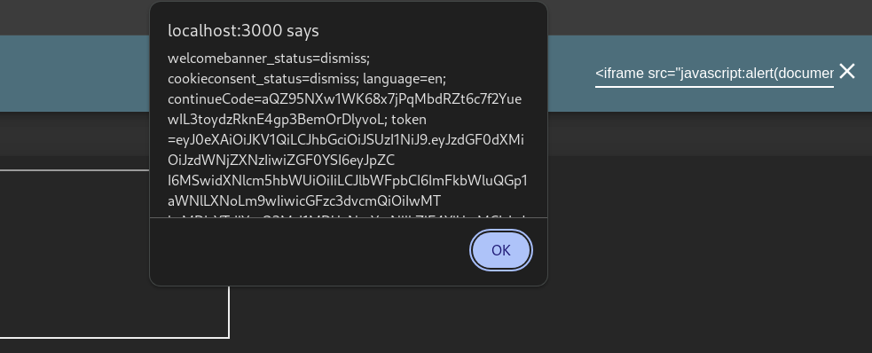

### 3. Administration Panel

By analyzing the website's source code in the browser's developer tools, we can identify hidden directories, including the **administration** directory, which provides access to the admin panel.

#### Steps to Reproduce:
1. Open the **Developer Tools** in your browser (press `F12` or right-click → "Inspect").
2. Navigate to **Sources** → **main.js**.
3. Search through the file to find references to site directories.
4. Locate the **administration** directory in the code and navigate to it in the browser.

#### Code Example:
The following snippet from `main.js` shows the location of the **administration** directory:

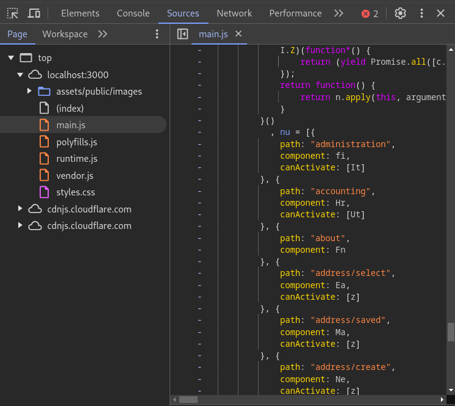

#### Admin Panel Access:
By visiting the `/administration` directory, we gain access to the admin panel, which includes functionalities to:
- Manage user comments.
- View and control user accounts.

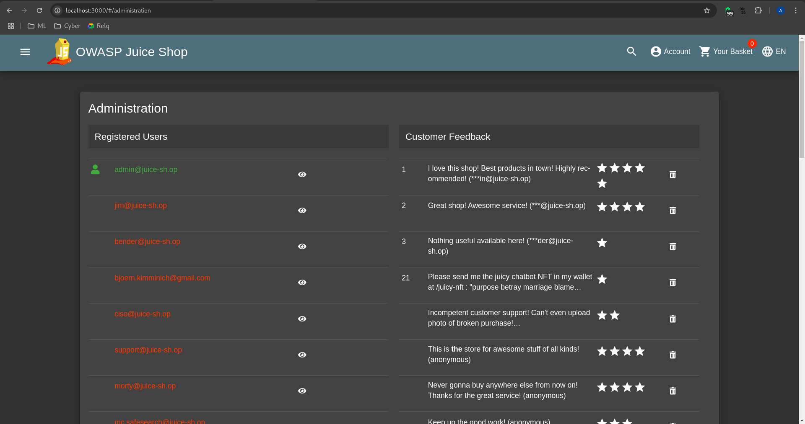

#### Potential Impact:
- Unauthorized access to sensitive administrative functionalities.
- Potential manipulation or theft of user data.
- Exposure of confidential application data and backend logic.

#### Mitigation:
- Remove hard-coded references to sensitive directories in client-side code.
- Implement robust authentication and authorization for administrative pages.
- Obfuscate JavaScript files to make it more challenging to extract sensitive information.
- Use access control lists (ACLs) and enforce role-based access control (RBAC) mechanisms.

### 4. Post a product review as another user
In the feedback section of the website, we discovered that it's possible to send feedback on behalf of another user by manipulating the request data. This type of vulnerability is known as **Insecure Direct Object Reference (IDOR)**.

#### Steps to Reproduce:
1. Open **Burp Suite** and enable **Intercept Mode** under the **Proxy** tab.
2. Submit a feedback request on the website as usual.
3. In Burp Suite, intercept the feedback request.
4. Modify the intercepted request by replacing the email address field with the email of the user for whom you want to send feedback.

#### Example:
The original feedback request:

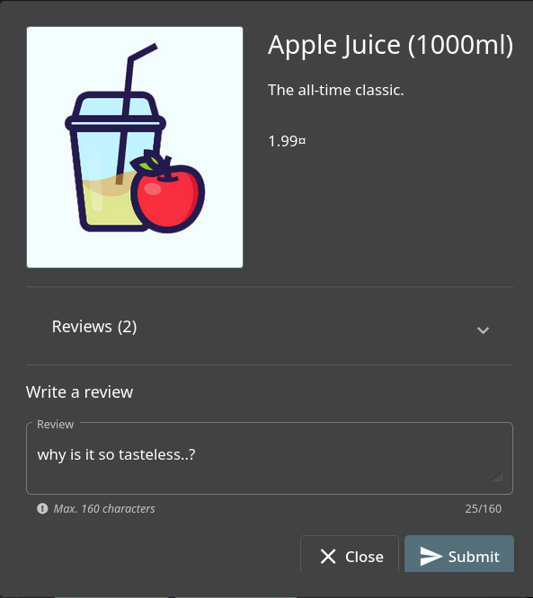

In Burp Suite, you can modify the intercepted request:

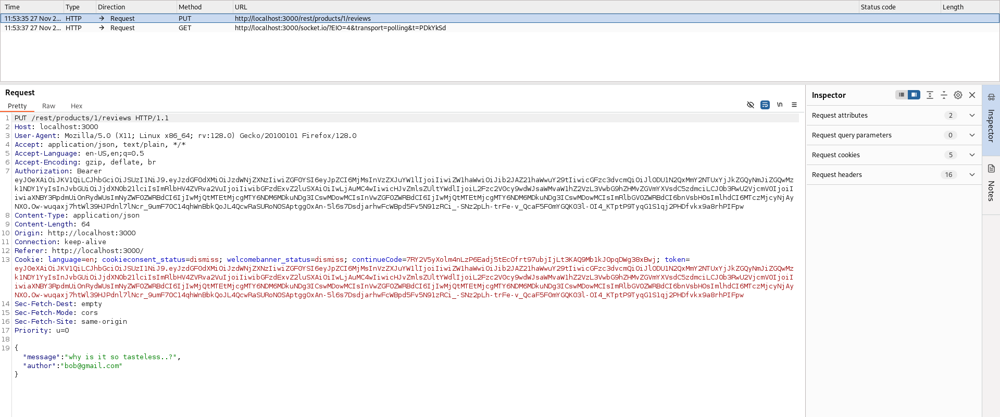

Replace the email with the target user's email:

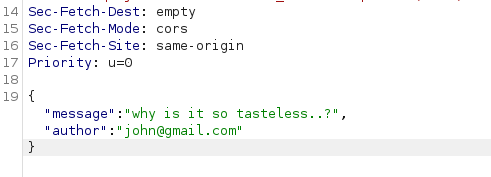

Once you forward the modified request:

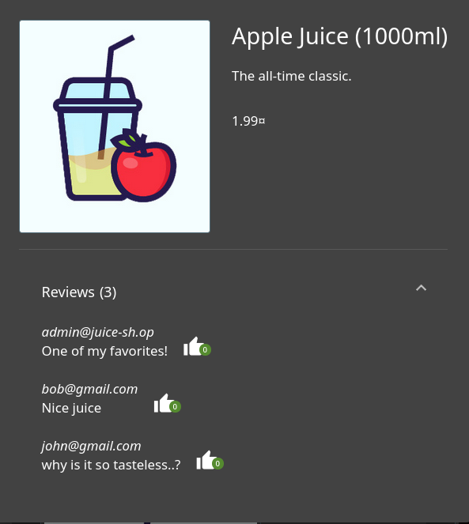

You will see that the feedback has been sent from the target user's email address, demonstrating the IDOR vulnerability.

#### Potential Impact:
- Malicious users can send feedback or perform actions on behalf of other users.
- This can lead to impersonation, spam, or manipulation of feedback data.
- Potentially expose user-specific information if the IDOR is exploited in other parts of the site.

#### Mitigation:
- Ensure that sensitive user data, such as email addresses, cannot be manipulated in requests.
- Implement access control checks on the server side to ensure that users can only access their own resources.
- Use secure session management to validate user identity for every request involving user-specific data.

### 5. View Another User's Shopping Basket

In this vulnerability, we discovered that it's possible to view and manipulate another user's shopping basket by modifying the request parameters. This can be done using **Burp Suite** in **Intercept Mode**.

#### Steps to Reproduce:
1. Open **Burp Suite** and enable **Intercept Mode** under the **Proxy** tab.
2. Click on the shopping basket icon to view your own basket.

3. In Burp Suite, intercept the request that retrieves the basket.
4. Modify the request by changing the basket number to that of another basket id.
5. Forward the modified request.

#### Example:
Original request showing the basket:

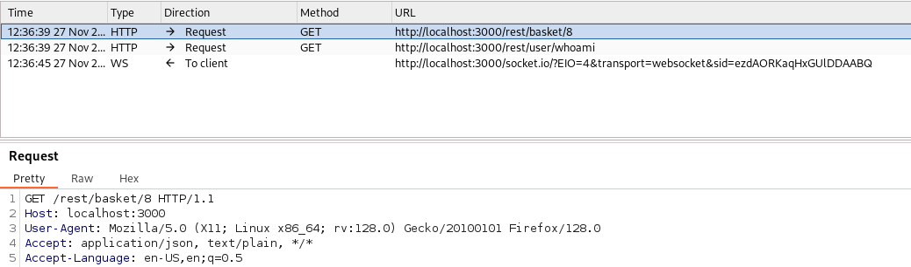

Changed request showing the basket:

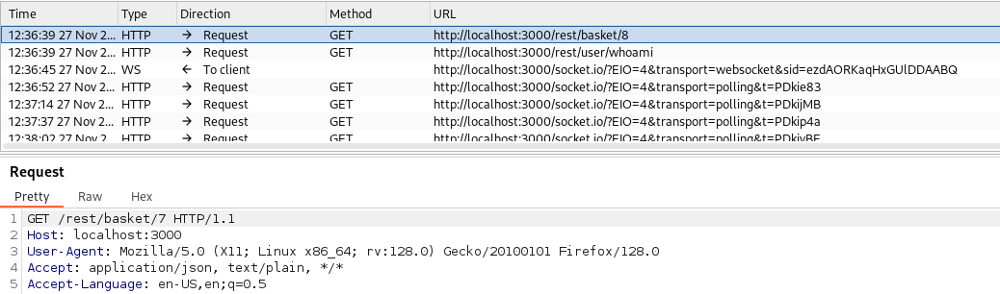

Once the basket number is changed to another user's ID, the shopping basket for that user will be displayed, as shown below:

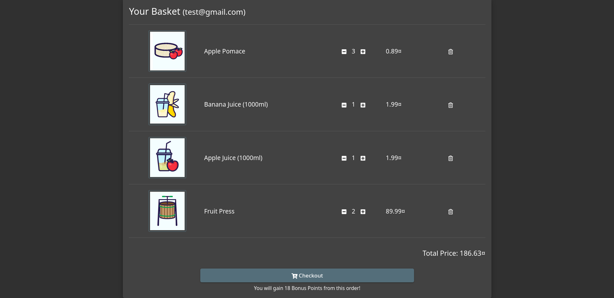

#### Potential Impact:
- Malicious users can view and potentially modify another user's shopping basket.
- This could lead to unauthorized access to sensitive user information such as purchased items, discounts, or personal preferences.
- Exploiting this vulnerability could also allow attackers to add or remove items from other users' baskets.

#### Mitigation:
- Use secure session management to ensure that the request corresponds to the correct user.
- Implement server-side checks to validate that users can only access their own shopping basket.
- Avoid relying on client-side data for sensitive operations such as modifying the shopping basket.

---

## 2) Root Me

- **Step 1:  Get connected**

We need to connect to the TryHackMe network and deploy the machine to gain access to it.

To connect to THM network, you need to download the OpenVPN GUI open-source application and import your VPN configuration file.

Connecting with ``Linux``:

1. Download OpenVPN by running the following command in your terminal:

    ```bash
        sudo apt install
        sudo apt install openvpn
    ```

2. Locate the full path to your VPN configuration file (download from the [access](https://tryhackme.com/r/access) page), normally in your Downloads folder.

3. Use your OpenVPN file with the following command: 
 
    ```bash
        sudo openvpn /path-to-file/file-name.ovpn
    ```

4. If you see the "Initialization successfully completed" that's it! You should be successfully connected.


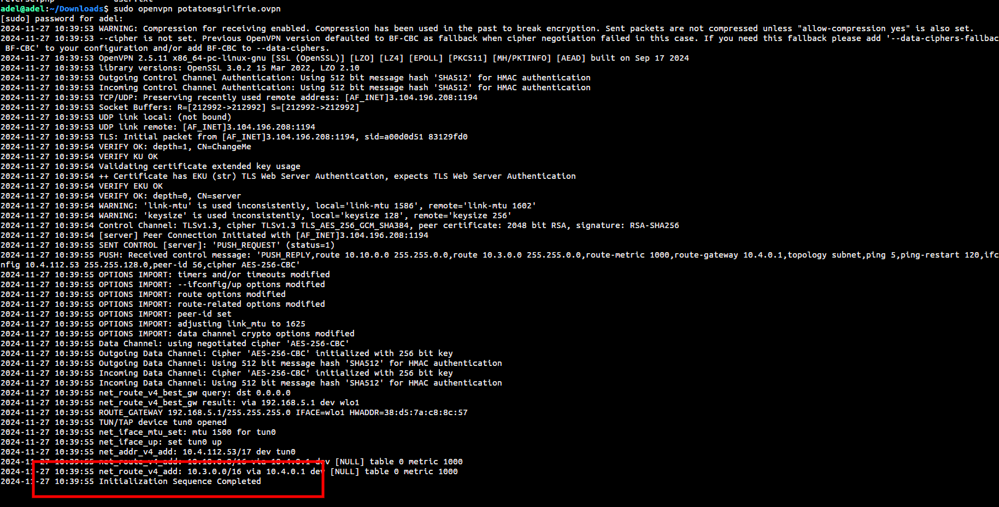

- **Step 2:  Start the machine**

Start the machine to get the ip.

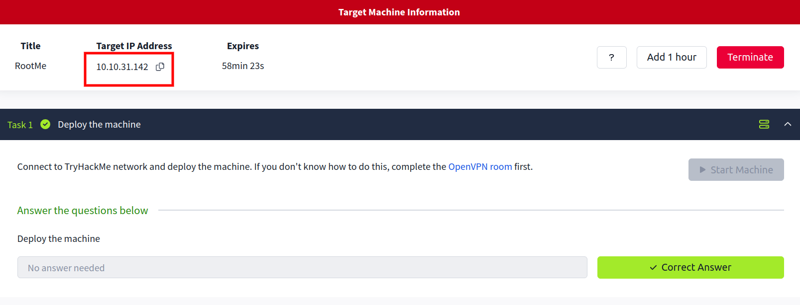


- **Step 3:  Scanning the target NMAP**

1. Let's use Nmap to see how many ports are open and what protocols are running on them.


    ```bash
        sudo nmap -sS -sV <target-IP>
    ```

    `sudo` : Nmap requires root privileges to perform some advanced scans.

    `-sS` : Performs a TCP SYN scan, which is faster and less detectable.

    `-sV` : Detects service versions running on the open ports.


- **Step 4:  Scanning the target GoBuster**

    `Gobuster`: Gobuster is a command-line tool used for brute-forcing URLs and directories on websites, as well as DNS subdomains. It helps security analysts discover hidden content by testing a list of possible names quickly.

    ```bash
        sudo apt install
        sudo apt install gobuster
    ```

    `Dirb`: Dirb is a web content scanner that searches for hidden directories and files on a web server by brute-forcing a wordlist. It helps identify potential entry points for further security testing.

    ```bash
        sudo apt install dirb
    ```

    ```bash
        gobuster -u 10.10.31.142 -w /usr/share/dirb/wordlists/small.txt
    ```
    `-u` 10.10.31.142: Specifies the target IP address.

    `-w` /usr/share/dirb/wordlists/small.txt: Uses a wordlist (small.txt) from Dirb’s collection to test for hidden directories.

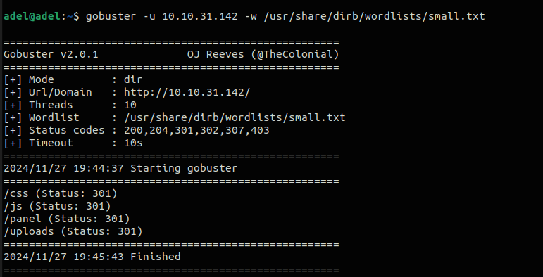

Then testing all directories to see if they are hidden.


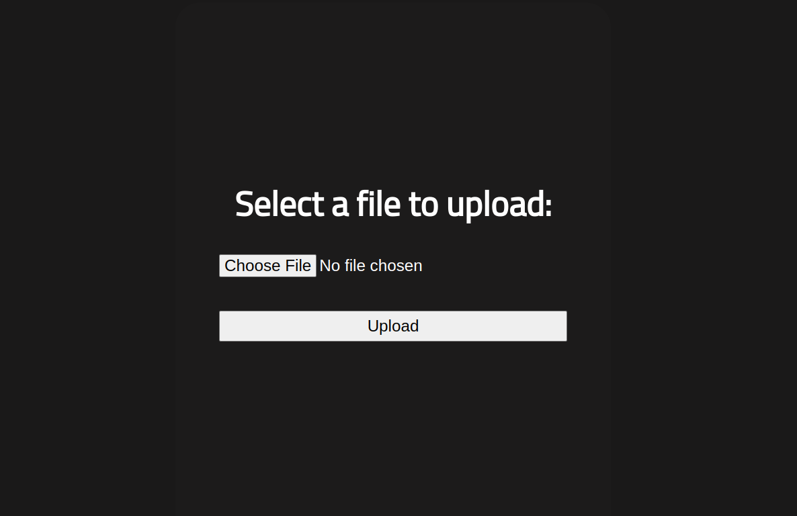

- **Step 5:  Reverse shell**


Then, we create a `reverseshell.php5` file and upload it.
You can get the reverse shell code from here: [Reverse shell](https://github.com/pentestmonkey/php-reverse-shell.git)


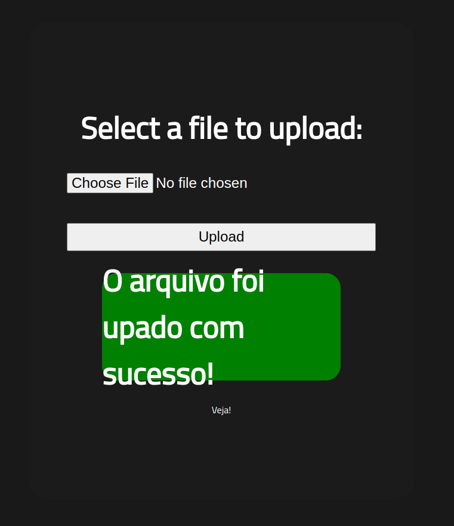

Now that we have successfully uploaded the file, we should initiate the reverse shell by going to the uploads directory.

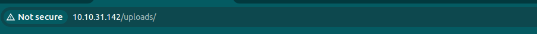

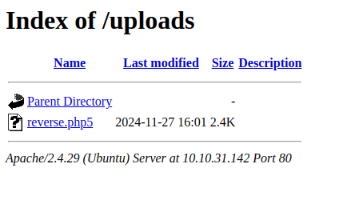

Before executing the PHP file, we should use   `nc` to listen for incoming requests on our VPN IP.

We should use the VPN IP to listen because we need to be on the same network. Since the machine is in the THM network, we must use the VPN.

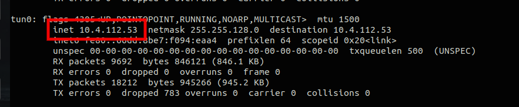

`nc`: (Netcat) is a command-line tool used for creating TCP/UDP connections and listening on ports. It is commonly used for tasks like transferring data or setting up reverse shells.

```bash
    sudo nc -lvnp 86 -s 10.4.112.53
```


`sudo`: Runs the command with root privileges.

`nc`: Invokes the Netcat tool.

`-l`: Tells Netcat to listen for incoming connections.

`-v`: Enables verbose mode, providing more detailed output.

`-n`: Prevents DNS resolution (uses IP addresses directly).

`-p 86`: Specifies the port number (86) to listen on.

`-s 10.4.112.53`: Sets the source IP address to 10.4.112.53.

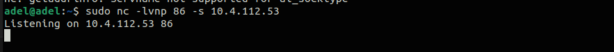

Here we are in our Target shell! =D

`NOTE`: In reverse shell no tabs and arrows, they are not working! =D

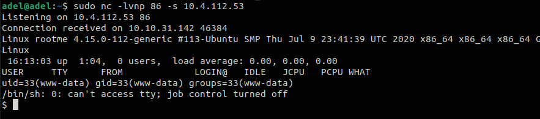

We can do any command we want, and explore the whole enviroment.

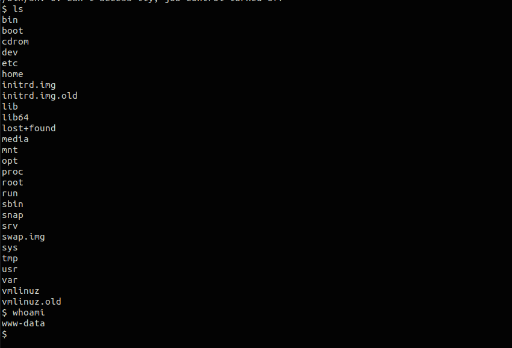

- **Step 6:  Exploring for data**


`SUID`: (Set User ID) is a special permission in Unix-like systems that allows a user to execute a file with the permissions of the file's owner, rather than the permissions of the user running the file. This is commonly used for programs that require elevated privileges, such as changing system configurations or accessing restricted resources.

Setting the SUID permission on `/usr/bin/python` is unusual and potentially risky, as Python normally doesn't need elevated privileges to run. If an attacker exploits this, they could gain root access by executing Python scripts with root privileges. 

`GTFOBins`: is a curated list of Unix binaries that can be exploited to escalate privileges or bypass security mechanisms. It includes tools that are commonly available on systems, such as find, vim, bash, and others, which, when misconfigured (e.g., with SUID permissions), can be used for privilege escalation or launching reverse shells. It's a valuable resource for penetration testers and attackers looking to leverage existing tools for privilege escalation.

here is a usefull site for gtfobins: `https://gtfobins.github.io/`


```bash
	python -c 'print(open("file_to_read").read())'
```

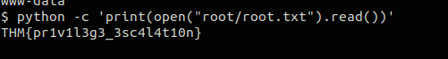


## Conclusion


This Root Me CTF walkthrough offers a step-by-step guide for beginners to engage with TryHackMe’s machine, starting from connecting to the network via OpenVPN to performing tasks such as scanning with Nmap, brute-forcing directories with GoBuster, and uploading a reverse shell for remote access.

- `VPN Connection`: Users connect to the TryHackMe network using OpenVPN, ensuring they can access the target machine securely.

- `Scanning with Nmap and GoBuster`: These tools help identify open ports, services, and potential hidden directories on the target system.
- `Reverse Shell Setup`: After uploading a reverse shell PHP script, the user listens for incoming connections using Netcat on their VPN IP.
- `Privilege Escalation`: Once inside the shell, the user explores potential vulnerabilities like SUID permissions and references resources like GTFOBins to escalate privileges.